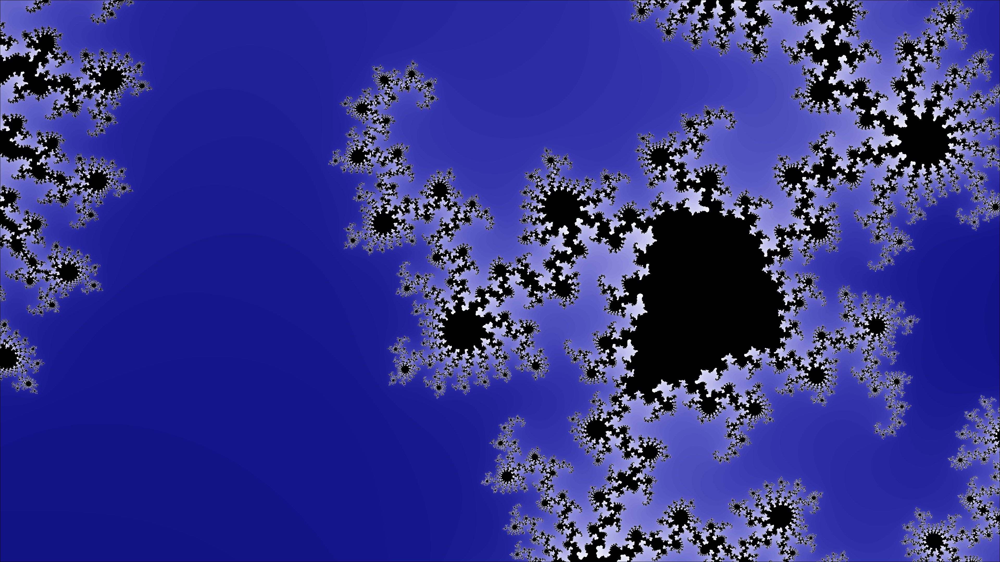
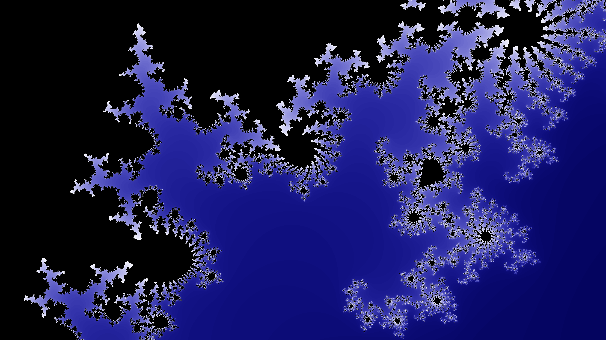
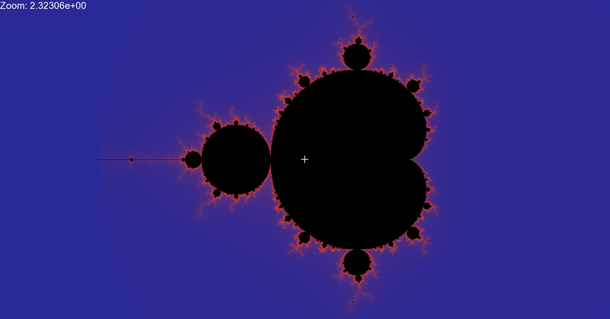

# mandelbrot
This project is a revival of one I made years ago in this revival I am using GLSL to made the viewer gpu accelerated.  
This seems like the best project to learn about fragment shaders since each pixel in the mandelbrot set is calculated with the same equation so it would greatly benefit from a multi core GPU.  

## building
This project is made in SFML and uses GLSL shaders. The SFML is used to deal with hardware inputs to directly interact and zoom and pan through the fractal.  
the included .exe will run with the DLL files. To recompile you will need to install MINGW64 and SFML 3.0.0  

## the mandelbrot set is a beautiful fractal, going on for infinity  

## the beauty is unmatched and iconic  

## Colours can really change the loops of the fractal and how we percieve it   

